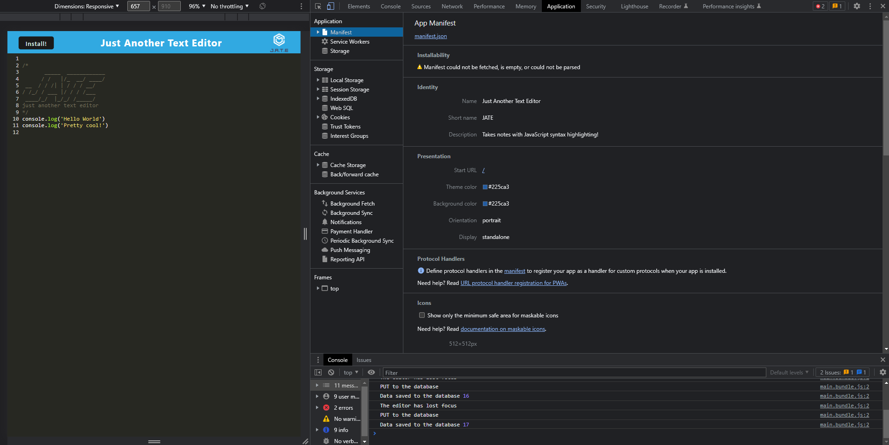
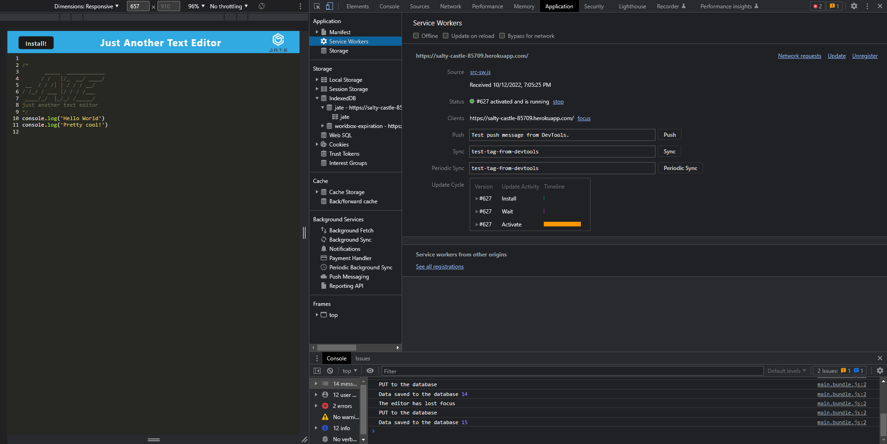
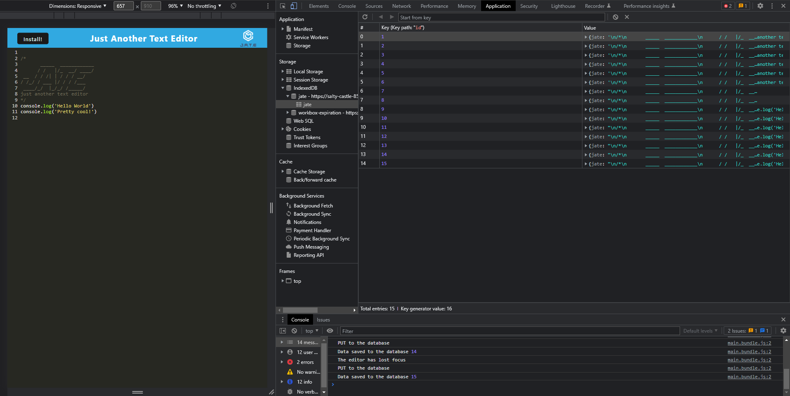

# JATE - Just Another Text Editor
  

  
  ## Description 
  This application converts a text editor app into a functioning PWA and allows it to function offline. 

  ## Table of Contents
  * [Installation](#installation)
  * [Usage](#usage)
  * [License](#license)
  * [Contributing](#contributing)
  * [Tests](#tests)
  * [Questions](#questions)
  
  ## Installation 
  Navigate to the deployed [application](https://salty-castle-85709.herokuapp.com/), and then click the install button located in the top left of the application. Click install once again in the popup window. You will now have a desktop shortcut to access the application from your device locally.

  ## Usage 
  Navigate to the walkthrough video here: [Screencastify](https://drive.google.com/file/d/1smifrf2WMzYejQA5fCBgxk1fFNT7VYBK/view)
   
  
  The following image shows the application's `manifest.json` file:

  

  The following image shows the application's registered service worker: 

  

  The following image shows the application's IndexedDB storage:

  

  ## License 
  This project is license under MIT

  ## Contributing 
  If you would like to contribute please reach out via email.

  ## Tests
  N/A

  ## Questions
  If you have any questions about this projects, please contact me directly at tyler.rodgers74@gmail.com. You can view more of my projects at https://github.com/TSRodgers.
